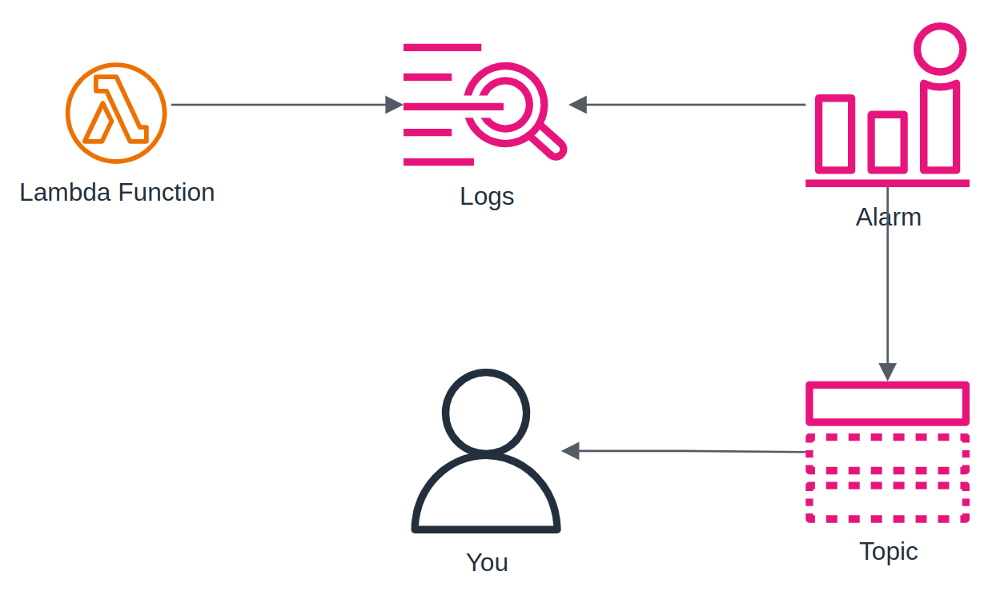

# CloudWatch Alarm Lambda Timeout

This sample creates a CloudWatch Alarm that monitors the timeout of a Lambda function and publishes a message to an SNS topic when the alarm is triggered.

## Dependencies

Before running this sample, you must install the following dependencies:

- [AWS CLI](https://aws.amazon.com/cli/)
- [Serverless Framework](https://www.serverless.com/framework/docs/getting-started/)

## Deploying

To deploy this sample, run the following command:

```bash
sls deploy
```

## Testing

**To test this sample, just invoke the Lambda function.**

To invoke the Lambda function using the Serverless Framework, run the following command:

```bash
sls invoke -f main
```

Optionally, you can invoke the Lambda function using the AWS CLI (or even the AWS Console).

# Diagram


